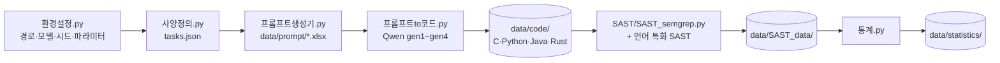

# 생성형 AI가 제공한 코드의 보안성 — 모델 세대 · 언어 · 프롬프트 요인의 종단 분석

> **Does a new model generation mean safer code?**
> 동일 계열 개방형 가중치 LLM(Qwen)의 4개 세대를 순서형 독립변수로 두고, 생성 코드의 **기능성과 보안성을 동일 사양 · 동일 계측기로 반복 측정**하여 두 축의 세대 추세를 추론통계로 검정하는 연구 저장소입니다.


연세대학교 정보대학원 정보보호 트랙 석사학위논문 · 차시현

---

## 목차

1. [연구 개요](#1-연구-개요)
2. [실험 설계](#2-실험-설계)
3. [파이프라인](#3-파이프라인)
4. [폴더 구조](#4-폴더-구조)
5. [설치](#5-설치)
6. [실행 방법](#6-실행-방법)
7. [고정 파라미터 (재현성)](#7-고정-파라미터-재현성)
8. [측정 도구와 지표](#8-측정-도구와-지표)
9. [진행 현황](#9-진행-현황)
10. [라이선스 · 참고문헌](#10-라이선스--참고문헌)

---

## 1. 연구 개요

LLM 공급자의 릴리스 노트와 기술 보고서는 기능적 성능 향상을 공표하지만, **생성 코드의 보안성은 고지 항목이 아닙니다.** 「성능이 향상되었다」는 공표는 있으나 「보안성이 향상되었다」를 검증할 측정 수단은 없습니다. 본 연구는 그 측정 수단을 제공합니다.

선행연구(채서연, 2025)의 **횡단 설계**(3개 모델 × 2개 언어 × 3개 프롬프트, 540표본)를 계승하여, 동일 계열 내 **세대를 종단 축**으로 확장합니다.

### 연구 질문

| | 연구 질문 |
|---|---|
| **RQ1** | 세대가 진행됨에 따라 생성 코드의 기능적 정확성은 향상되는가? |
| **RQ2** | 세대가 진행됨에 따라 보안 취약점 밀도는 감소하는가? |
| **RQ3** | 기능–보안 격차(functionality–security gap)는 세대에 따라 축소되는가? |
| **RQ4** | 기능–보안 격차의 크기는 프로그래밍 언어(C / Python / Java / Rust)에 따라 조절되는가? |
| **RQ5** | 보안 프롬프트의 효과는 취약점 식별과 조치 구체성 중 어느 성분에서 발생하며, 그 효과는 세대에 따라 변화하는가? |

---

## 2. 실험 설계

### 2.1 요인 구성

| 요인 | 수준 | 비고 |
|---|---|---|
| **모델 세대** (순서형) | 4 | Qwen Dense 7.6~8.2B, 2024-02 ~ 2025-04 |
| **언어** | 4 | C · Python · Java · Rust |
| **프롬프트** | 5 | 통제군 P0 + 2 × 2 완전 요인설계 (P1~P4) |
| **기능 사양** | 30 | 반복측정 단위 (전 세대 · 전 조건에 동일 투입) |
| **반복** | 5 | 시드만 변주 (반복 변동성 측정 후 확정) |

| 단계 | 구성 | 표본 수 | 용도 |
|---|---|---:|---|
| 변동성 측정 | 4 × 4 × P0 × 3사양 × 5반복 | 240 | 반복 5회의 근거 확정 |
| **0단계** 표적 선정 | 4 × 4 × P0 × 30 × 1 | 480 | 사양별 표적 CWE 확정 (분석 제외, 부록 보고) |
| **1단계** 본 실험 | 4 × 4 × 5 × 30 × 5 | **12,000** | 주분석 |

### 2.2 모델 — Qwen Dense 4세대

| 세대 | Hugging Face ID | 공개 | 파라미터 | 라이선스 | 선정 근거 |
|---|---|---|---:|---|---|
| gen1 | `Qwen/Qwen1.5-7B-Chat` | 2024-02 | 7.7B | Tongyi Qianwen | 코드 특화 · 보안 정렬 이전의 기저선 |
| gen2 | `Qwen/Qwen2-7B-Instruct` | 2024-06 | 7.6B | Apache-2.0 | Apache 2.0 전환 첫 세대 |
| gen3 | `Qwen/Qwen2.5-7B-Instruct` | 2024-09 | 7.6B | Apache-2.0 | 코드 성능을 전면 공표한 세대 (파일럿 실측) |
| gen4 | `Qwen/Qwen3-8B` | 2025-04 | 8.2B | Apache-2.0 | Dense 최종 규격 · 사고 모드 차단(`enable_thinking=False`) |

전 세대 로컬 실행(API 비용 없음). Qwen3.5 이후는 희소 MoE로 아키텍처가 교락되므로 주분석에서 제외합니다.

### 2.3 프롬프트 — 2 × 2 완전 요인설계 + 통제군

선행연구의 Secure-Natural · Secure-Explicit 두 조건은 **식별자 명시와 조치 구체성이 동시에 변하는 대각선**이므로 효과를 분리할 수 없습니다. 결측된 두 셀(P2 · P3)을 채워 주효과와 상호작용을 분리 검정합니다.

| | **요인 B — 서술적** (목표만 진술) | **요인 B — 구체적** (MITRE Potential Mitigations 자동 인용) |
|---|---|---|
| **요인 A — 식별자 미명시** | **P1** ≡ 선행연구 Secure-Natural | **P2** 신설 |
| **요인 A — 식별자 명시** (CWE-ID) | **P3** 신설 | **P4** ≡ 선행연구 Secure-Explicit |

**P0 통제군** — 보안 언급 없이 기능 요구만 기술합니다. 전 조건에서 코드 스니펫과 패치는 포함하지 않습니다.

### 2.4 기능 사양 30건

선정 기준: ① 4개 언어 공통 실현 가능 ② 표준 라이브러리만 사용 ③ 반환값 보유 ④ 취약 구현과 안전 구현이 모두 표준 라이브러리로 실현 가능.
전체 목록과 4개 언어 시그니처는 [`data/prompt/사양목록.xlsx`](data/prompt/사양목록.xlsx)에 있습니다.

<details>
<summary>설계 의도 CWE 30건 펼치기</summary>

| | | | |
|---|---|---|---|
| T01 CWE-22 경로 순회 | T09 CWE-190 정수 오버플로 | T17 CWE-367 TOCTOU | T25 CWE-770 제한 없는 할당 |
| T02 CWE-78 OS 명령 주입 | T10 CWE-195 부호 변환 | T18 CWE-369 0으로 나누기 | T26 CWE-772 자원 해제 누락 |
| T03 CWE-88 인자 주입 | T11 CWE-208 타이밍 비교 | T19 CWE-377 임시 파일 | T27 CWE-787 경계 초과 쓰기 |
| T04 CWE-89 SQL 주입 | T12 CWE-209 오류 정보 노출 | T20 CWE-400 자원 소진 | T28 CWE-1236 CSV 수식 주입 |
| T05 CWE-90 LDAP 주입 | T13 CWE-601 오픈 리다이렉트 | T21 CWE-476 널 역참조 | T29 CWE-697 부적절한 비교 |
| T06 CWE-117 로그 주입 | T14 CWE-79 XSS | T22 CWE-20 입력 검증 | T30 CWE-285 권한 검사 |
| T07 CWE-125 경계 초과 읽기 | T15 CWE-113 HTTP 응답 분할 | T23 CWE-732 권한 부여 | |
| T08 CWE-134 형식 문자열 | T16 CWE-330 불충분한 난수 | T24 CWE-755 예외 처리 | |

`cwe_hint`는 설계 의도일 뿐 프롬프트에 사용하지 않습니다. 표적 CWE는 0단계 관측으로 실험 전 1회 확정하여 전 세대에 고정합니다.
</details>

---

## 3. 파이프라인



| 순서 | 스크립트 | 입력 | 출력 |
|:-:|---|---|---|
| 0 | `code/환경설정.py` | — | `data/environment.json`, `model/` |
| 1 | `code/사양정의.py` · `code/사양검증.py` | — | `data/prompt/tasks.json`, `사양목록.xlsx` |
| 2 | `code/프롬프트생성기.py` | `tasks.json` | `data/prompt/*.xlsx` |
| 3 | `code/프롬프트to코드.py` | 프롬프트 · 모델 | `data/code/<언어>/*` |
| 4 | `SAST/SAST_semgrep.py` | 생성 코드 | `data/SAST_data/*.xlsx` |
| 5 | `code/통계.py` | SAST 결과 | `data/statistics/*.xlsx` |

---

## 4. 폴더 구조

가상환경(`.venv/`)과 모델 가중치(`model/*`)는 저장소에 포함하지 않습니다.

```
llm-generated-code-security-analysis/
├─ code/                         실행 스크립트
│   ├─ 환경설정.py               전역 설정의 단일 원천 · 환경 점검 · 모델 다운로드 · 적재 시험
│   ├─ 사양정의.py               기능 사양 30건 정의 → tasks.json · 사양목록.xlsx
│   ├─ 사양검증.py               120개 시그니처 컴파일 검증 · 테스트 오라클 검증
│   ├─ 참조구현.py               오라클 검증용 Python 참조 구현 (실험 표본 아님)
│   ├─ 프롬프트생성기.py         P0~P4 프롬프트 생성
│   ├─ 프롬프트to코드.py         세대별 코드 생성
│   └─ 통계.py                   통계 분석
├─ data/
│   ├─ code/                     생성 코드 (언어별)
│   │   ├─ C/  ├─ Python/  ├─ Java/  └─ Rust/
│   ├─ prompt/                   tasks.json · 사양목록.xlsx · 프롬프트 엑셀
│   ├─ SAST_data/                SAST 결과 엑셀 · raw/ 원시 리포트(JSON)
│   └─ statistics/               통계 결과 엑셀
├─ model/                        세대별 가중치 · model_manifest.json (커밋 해시 고정)
├─ SAST/
│   ├─ SAST_semgrep.py           공통축 SAST (Semgrep)
│   └─ rules/semgrep/            고정 규칙 스냅숏 · manifest.json
├─ requirements.txt              Python 의존성
├─ requirements.lock.txt         설치 실측 버전 (pip freeze)
├─ setup_venv.cmd / .ps1         가상환경 설치 (더블클릭)
└─ README.MD
```

### 생성 코드 파일명 규칙

```
<단계>_<세대>_<언어>_<사양>_<조건>_r<반복>.<확장자>
  예) S1_gen3_Python_T04_P2_r3.py
단계: S0 = 0단계(표적 선정) · S1 = 1단계(본 실험) · SV = 반복 변동성 측정
```

0단계 표본은 파일명 접두어(`S0_`)로 구분되므로 같은 폴더에 저장해도 분석에서 자동 분리됩니다.

---

## 5. 설치

**요구 사항**: Windows 10/11 · Python 3.11 · NVIDIA GPU(VRAM 8 GB 이상, CUDA 13.x 드라이버) · 디스크 여유 70 GB 이상

```powershell
# 1) 가상환경 + 의존성 설치 — 더블클릭 또는
powershell -ExecutionPolicy Bypass -File .\setup_venv.ps1

# 2) 이후 의존성이 추가된 경우
.\.venv\Scripts\python.exe -m pip install -r requirements.txt
```

`setup_venv.ps1`이 수행하는 작업:
1. `.venv` 생성 (Python 3.11)
2. torch를 CUDA 전용 인덱스(cu132)에서 설치
3. `requirements.txt` 설치 (torch 버전은 제약 파일로 고정)
4. `requirements.lock.txt` 기록
5. Jupyter 커널 등록 및 GPU · NF4 4bit · SAST 도구 점검

---

## 6. 실행 방법

모든 명령은 **프로젝트 루트에서 `.venv` 인터프리터로** 실행합니다.

```powershell
$py = ".\.venv\Scripts\python.exe"

# ── 0. 환경 ──────────────────────────────────────────────
& $py code\환경설정.py --check              # 환경 실측 → data\environment.json
& $py code\환경설정.py --download all       # 4세대 가중치 (약 62 GB) → model\
& $py code\환경설정.py --smoke all          # 세대별 적재 · 1건 생성 시험

# ── 1. 기능 사양 ─────────────────────────────────────────
& $py code\사양정의.py                      # tasks.json · 사양목록.xlsx 생성

# ── 4. SAST (Semgrep) ────────────────────────────────────
& $py SAST\SAST_semgrep.py --update-rules   # 규칙 스냅숏 고정 (최초 1회)
& $py SAST\SAST_semgrep.py                  # 전체 스캔 (고정 규칙)
& $py SAST\SAST_semgrep.py --stage main --lang C --gen gen1   # 범위 한정
& $py SAST\SAST_semgrep.py --config auto    # 레지스트리 자동 규칙 (탐색용)
```

---

## 7. 고정 파라미터 (재현성)

모든 값은 `code/환경설정.py`에만 정의되며, 전 세대 · 전 조건에 동일하게 적용됩니다.

| 항목 | 값 | 사유 |
|---|---|---|
| `temperature` / `top_p` | 0.2 / 0.95 | 결정성 확보 (0.0은 반복 루프 유발) |
| `top_k` / `repetition_penalty` | 0 (비활성) / 1.0 | 모델 카드별 기본값 차이 제거 |
| `max_new_tokens` | 768 | 단일 함수 생성에 충분 |
| 양자화 | NF4 4bit + double quant, bf16 연산 | 8 GB VRAM 적재 · 전 세대 동일 |
| `enable_thinking` | False | Qwen3 사고 모드 차단 |
| 시스템 프롬프트 | 전 조건 동일 (SHA-256 기록) | 조건 간 차이를 보안 문장으로 한정 |
| 시드 | 변동성 20260923 · 0단계 20260916 · 1단계 20261001 (+ 반복 인덱스) | 표적 선정과 본 실험의 순환성 차단 |
| 모델 버전 | 다운로드 시점 커밋 해시 고정 (`model/model_manifest.json`) | 은닉 변경 차단 |
| Semgrep 규칙 | `semgrep/semgrep-rules` 커밋 고정 (`SAST/rules/semgrep/manifest.json`) | 계측기 불변 |

### 적재 시험 실측 (RTX 5060 Laptop 8 GB, 2026-09-23)

| 세대 | 최대 VRAM | 디코딩 속도 | 사고 모드 차단 |
|---|---:|---:|:-:|
| gen1 Qwen1.5-7B-Chat | 5.52 GB | 4.18 tok/s | ✅ |
| gen2 Qwen2-7B-Instruct | 5.33 GB | 12.38 tok/s | ✅ |
| gen3 Qwen2.5-7B-Instruct | 5.33 GB | 14.01 tok/s | ✅ |
| gen4 Qwen3-8B | 5.78 GB | 10.81 tok/s | ✅ |

---

## 8. 측정 도구와 지표

### 8.1 SAST 구성 — 공통축 1종 + 언어 특화 1종

| 언어 | 공통축 | 언어 특화축 |
|---|---|---|
| C | Semgrep | Flawfinder |
| Python | Semgrep | Bandit |
| Java | Semgrep | SpotBugs + FindSecBugs |
| Rust | Semgrep | Clippy |

**Semgrep 규칙 고정 방식** (`SAST_semgrep.py`)
- 규칙 출처: `semgrep/semgrep-rules`의 특정 커밋에서 `c` · `python` · `java` · `rust`의 `category: security` 규칙과 `generic/secrets`만 추출합니다.
- 오프라인에서 실행하며, 실행 시점이 달라도 규칙이 변하지 않습니다.
- `--config auto`는 실행 시점에 레지스트리가 규칙을 고르므로 탐색용으로만 사용합니다.

**구문 유효성 판정**: Semgrep은 구문 오류가 있는 코드를 대부분 보고 없이 부분 파싱합니다. 파싱할 수 없는 코드가 「탐지 0건 = 안전」으로 집계되지 않도록, 컴파일이나 실행 없이 파서만으로 `syntax_ok`를 별도 기록합니다(Python은 `ast`, C · Java · Rust는 tree-sitter).

### 8.2 보안성 지표 6종

| 지표 | 정의 | 근거 |
|---|---|---|
| Vulnerability Density | 고유 취약점 수 / (ELOC / 1,000) | Alhazmi & Malaiya (2007) |
| Severity-Weighted Density | Σ 심각도 / (ELOC / 1,000) | FIRST CVSS v3.1 |
| Mean Severity | Σ 심각도 / 고유 취약점 수 | FIRST CVSS v3.1 |
| High-Severity Ratio | CVSS ≥ 8.0 취약점 / 전체 취약점 | — |
| Distinct CWE Count | 고유 CWE 유형 수 | MITRE CWE Top 25 |
| Files with Findings (%) | 취약점 1건 이상 파일 비율 | — |

- **ELOC**: 주석 · 공백을 제외한 코드 라인 수입니다.
- **다중 도구 결과 통합**: CWE로 매핑한 뒤 「파일 · 라인 · CWE」 기준으로 중복을 제거합니다(Muske & Serebrenik, 2016).

### 8.3 통계 절차

- **절차 분기**: 정규성 · 등분산성을 점검한 뒤 모수 / 비모수 절차로 나눕니다.
- **비모수 검정**: Kruskal–Wallis H, 사후 Mann–Whitney U
- **분산분석**: 요인 간 주효과 · 상호작용
- **세대 추세 검정**: Jonckheere–Terpstra, 직교 다항 대비
- **효과크기 · 다중비교**: η² · Cliff's δ, Benjamini–Hochberg FDR, 등가성 검정 TOST
- **강건성**: 도구 민감도 분석, 10% 층화표본 2인 독립 재평정(Cohen's κ ≥ 0.70 목표)

---

## 9. 진행 현황

- [x] 가상환경 구축 · GPU / NF4 / SAST 도구 점검 (2026-09-23)
- [x] `환경설정.py` — 전역 설정 · 모델 4세대 다운로드 · 적재 시험 통과
- [x] 기능 사양 30건 재작성 · 120개 시그니처 컴파일 검증 · 테스트 오라클 검증
- [x] `SAST_semgrep.py` — 고정 규칙 · 구문 유효성 · ELOC · 엑셀 출력
- [ ] `프롬프트생성기.py` — P0~P4 문구 생성
- [ ] `프롬프트to코드.py` — 세대별 생성
- [ ] 반복 변동성 측정 (240건) → 반복 횟수 확정
- [ ] 0단계 표적 선정 (480건) → 표적 CWE 30건 확정 · 전수 검증
- [ ] 언어 특화 SAST (Flawfinder · Bandit · SpotBugs+FindSecBugs · Clippy)
- [ ] 1단계 본 실험 (12,000건)
- [ ] `통계.py`

---

## 10. 라이선스 · 참고문헌

**모델 라이선스**
- **Qwen1.5**: Tongyi Qianwen License를 따릅니다. 연구 목적의 사용 · 복제 · 재배포를 허용합니다.
- **Qwen2 이후**: Apache-2.0을 따릅니다.
- **사용 범위**: 본 연구는 생성 코드를 분석 대상으로만 사용하며 모델 학습에는 사용하지 않습니다.

**Semgrep 규칙**: [Semgrep Rules License v1.0](https://semgrep.dev/legal/rules-license)을 따릅니다. 규칙 원문은 저장소에 포함하지 않고, 커밋 해시(`manifest.json`)로 재현합니다.

**참고문헌**
- 채서연 (2025). 『생성형 AI가 제공한 코드는 얼마나 안전한가 — 모델, 언어, 프롬프트 간 보안성 영향 분석』. 연세대학교 정보대학원 석사학위논문.
- Peng, J. et al. (2025). *CWEval: Outcome-driven Evaluation on Functionality and Security of LLM Code Generation.* [arXiv:2501.08200](https://arxiv.org/abs/2501.08200)
- Chen, L., Zaharia, M., & Zou, J. (2023). *How Is ChatGPT's Behavior Changing over Time?* [arXiv:2307.09009](https://arxiv.org/abs/2307.09009)
- Arcuri, A., & Briand, L. (2014). *A Hitchhiker's Guide to Statistical Tests for Assessing Randomized Algorithms in Software Engineering.* STVR 24(3). [doi:10.1002/stvr.1486](https://doi.org/10.1002/stvr.1486)
- MITRE. *CWE View-1000: Research Concepts.* [cwe.mitre.org](https://cwe.mitre.org/data/definitions/1000.html)
